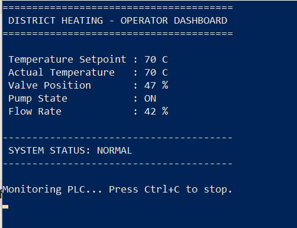
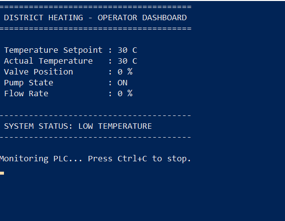
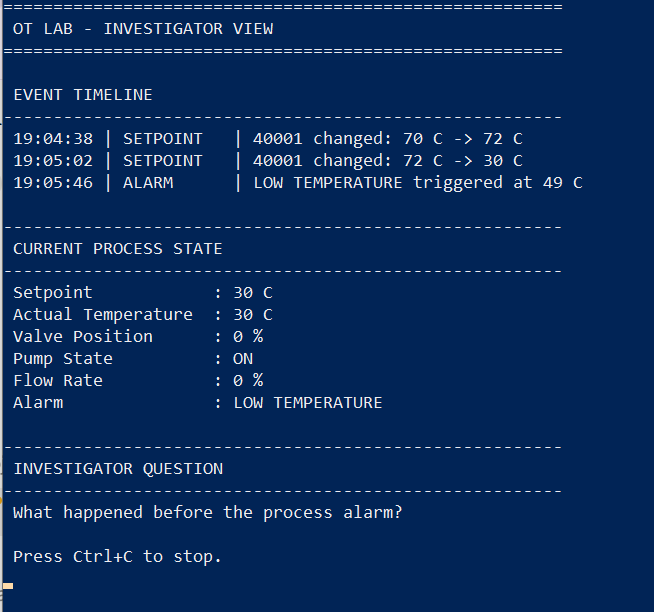
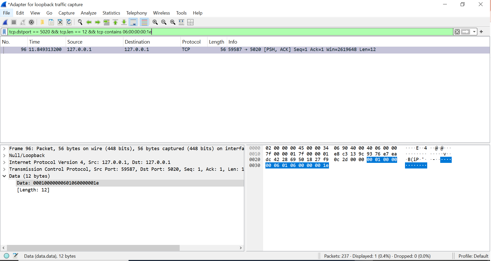

# OT Security Lab: Protocol-Valid, Process-Unsafe

A safe, isolated Modbus TCP simulation for exploring how legitimate industrial protocol functionality can produce undesired process outcomes, and how process, event, and network evidence can support investigation.

## Overview

Industrial control systems often rely on protocols designed primarily for reliable process communication. A command can therefore be syntactically valid and successfully executed by a controller while still producing an undesirable process outcome.

This lab demonstrates that problem using a simplified district-heating process and a simulated Modbus TCP PLC.

The central question is:

> **When an unauthorized action uses legitimate industrial protocol functionality, what evidence helps an operator or investigator understand what happened?**

The lab does not reproduce ICS malware or interact with real industrial equipment. It is an isolated educational simulation designed for defensive OT-security learning.

## Architecture

The lab contains four main perspectives:

1. **Simulated PLC and process** — maintains process registers and models simplified heating behaviour.
2. **Operator** — monitors process conditions and performs an authorized setpoint change.
3. **Controlled injector** — performs a lab-only unauthorized setpoint change using the same legitimate Modbus function.
4. **Investigator** — correlates process state with a timeline of preceding control-system events.

Network traffic can also be inspected with Wireshark.

```text
                     Modbus TCP
               ┌──────────────────┐
               │                  │
        ┌──────▼───────┐    ┌─────▼────────────┐
        │  Operator /  │    │ Controlled       │
        │  FC03 + FC06 │    │ Injector / FC06  │
        └──────┬───────┘    └─────┬────────────┘
               │                  │
               └────────┬─────────┘
                        │
                 127.0.0.1:5020
                        │
                 ┌──────▼───────┐
                 │ Simulated PLC│
                 │  Modbus TCP  │
                 └──────┬───────┘
                        │
                 ┌──────▼────────┐
                 │ Simplified    │
                 │ Heating       │
                 │ Process       │
                 └──────┬────────┘
                        │
              ┌─────────┴─────────┐
              │                   │
      ┌───────▼────────┐  ┌──────▼──────────┐
      │ Operator       │  │ Investigator    │
      │ Dashboard      │  │ Event Timeline  │
      └────────────────┘  └─────────────────┘
```

## Lab Evidence

### Normal Process State

The operator dashboard shows the simulated process stabilized at its normal 70 °C setpoint.



### Controlled Setpoint Change and Process Response

Following the controlled FC06 setpoint change to 30 °C, the simulated process reaches a low-temperature condition with the valve closed and flow reduced to zero.



### Event Correlation

The investigator view correlates the preceding control actions with the later process alarm. In this simulation run, the 72 °C → 30 °C setpoint change occurred before the low-temperature alarm was triggered.



### Network Evidence

The controlled setpoint change can also be observed at the network level. The captured Modbus TCP payload contains an FC06 Write Single Register request to address `0`, with value `0x001e` (30 decimal).



The packet is protocol-valid. Determining whether such a write is authorized requires context beyond the function code and register value alone.

## Process Model

The simulated PLC exposes six holding registers.

| Register | Address | Simulated meaning    | Initial value |
| -------- | ------- | -------------------- | ------------- |
| 40001    | 0       | Temperature setpoint | 70 °C         |
| 40002    | 1       | Actual temperature   | 68 °C         |
| 40003    | 2       | Valve position       | 42%           |
| 40004    | 3       | Pump state           | ON            |
| 40005    | 4       | Flow rate            | 75%           |
| 40006    | 5       | Alarm state          | NORMAL        |

These register assignments are specific to this simulation and are not universal Modbus register definitions.

The process model is intentionally simplified. It is designed to illustrate cyber-physical cause and effect rather than accurately model district-heating thermodynamics.

## Modbus Operations

The lab primarily demonstrates two Modbus function codes:

* **FC03 — Read Holding Registers:** used to observe process state.
* **FC06 — Write Single Holding Register:** used to modify the simulated temperature setpoint.

The key observation is that FC06 itself is neither authorized nor malicious.

The same protocol-valid operation can represent normal process control, an unauthorized manipulation, or a recovery action depending on its context.

> **Protocol-valid does not mean process-safe.**

## Demonstration Scenario

The demonstration follows a simple incident lifecycle.

### 1. Normal operation

The process stabilizes around a 70 °C setpoint with no active alarm.

### 2. Authorized control action

`operator_write.py` performs an authorized FC06 write:

```text
70 °C → 72 °C
```

The PLC accepts the command and the process stabilizes at the new setpoint.

### 3. Controlled unauthorized action

`attack_injector.py` uses the same FC06 operation to change the setpoint:

```text
72 °C → 30 °C
```

The command is syntactically valid and accepted by the simulated PLC.

The process subsequently responds: temperature decreases, the valve closes, flow decreases, and eventually the low-temperature alarm is triggered.

### 4. Operator perspective

`operator_dashboard.py` displays the current process state.

The operator can observe the low-temperature condition and associated process symptoms, but the dashboard alone does not establish why the setpoint changed or whether the change was authorized.

### 5. Investigator perspective

`investigator_view.py` correlates the current process state with preceding events.

An example timeline is:

```text
SETPOINT | 40001 changed: 70 C -> 72 C
SETPOINT | 40001 changed: 72 C -> 30 C
ALARM    | LOW TEMPERATURE triggered at 49 C
```

This provides additional temporal context, but the event history alone still does not prove malicious intent.

Authorization records, source identity, expected operating conditions, network evidence, and other contextual information may be required.

### 6. Recovery

`recovery.py` restores the temperature setpoint to 70 °C.

As the simulated process recovers, temperature and flow increase and the low-temperature alarm eventually clears.

## Network Evidence

Because the lab uses Modbus TCP, the traffic can be captured locally with Wireshark.

For this simulation, traffic uses:

```text
127.0.0.1:5020
```

This simulation uses port `5020` rather than the registered Modbus TCP port `502` to keep the local lab configuration separate from standard Modbus TCP services.

An FC06 request changing register address `0` to decimal `30` contains the relevant Modbus values:

```text
Unit ID:       1
Function Code: 06
Address:       0
Value:         30
```

Both the authorized and controlled unauthorized writes are protocol-valid FC06 transactions.

The packet structure alone therefore does not establish intent.

## Event Correlation

The lab records important state transitions in `events.log`.

For example:

```text
SETPOINT | 70 C -> 72 C
SETPOINT | 72 C -> 30 C
ALARM    | LOW TEMPERATURE triggered
SETPOINT | 30 C -> 70 C
ALARM    | LOW TEMPERATURE cleared
```

This allows the investigator to reason about the sequence between a control-system change and its later process consequence.

A central lesson is:

> **Detection is not the same as understanding.**

## Project Files

* `plc_server.py` — simulated Modbus TCP PLC, process model, and event recording
* `registers.py` — reads the simulated holding registers using FC03
* `operator_write.py` — authorized FC06 setpoint change
* `attack_injector.py` — controlled lab-only FC06 setpoint manipulation
* `operator_dashboard.py` — operator-oriented process view
* `investigator_view.py` — event timeline and current process state
* `recovery.py` — restores the simulated process setpoint
* `events.log` — generated runtime event history; not committed to Git

## Installation

This project was developed with Python 3.12 and PyModbus 3.7.4.

Create and activate a virtual environment, then install the dependencies:

```powershell
python -m venv .env
.env\Scripts\Activate.ps1
pip install -r requirements.txt
```

## Running the Lab

Start the simulated PLC:

```powershell
python plc_server.py
```

In separate terminals, the components can then be run as required:

```powershell
python registers.py
python operator_dashboard.py
python operator_write.py
python attack_injector.py
python investigator_view.py
python recovery.py
```

## Safety and Scope

This repository is intended for defensive cybersecurity education and research.

The lab:

* runs against a local simulated PLC;
* uses loopback networking rather than real industrial equipment;
* does not contain or reproduce ICS malware;
* does not exploit industrial devices;
* does not require access to an operational technology environment.

The process dynamics and register assignments are deliberately simplified and should not be interpreted as an engineering model of a real district-heating installation.

## Key Takeaways

1. Legitimate industrial protocol functionality can produce undesirable process outcomes when used in the wrong context.
2. A PLC can correctly execute a command that should not have been issued.
3. Protocol syntax alone does not establish authorization or intent.
4. Process context helps defenders interpret otherwise legitimate-looking control traffic.
5. Operators and security investigators may see different parts of the same incident.
6. Correlating control actions, process changes, alarms, and network evidence can improve incident understanding.

---

**Core principle:** **Protocol-valid does not mean process-safe.**


